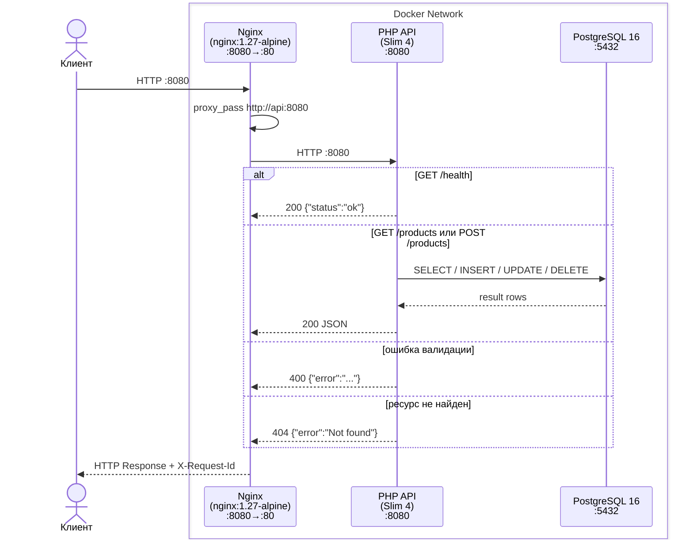

# Architecture

## HTTP Request Flow

```mermaid
sequenceDiagram
    actor Client as Клиент

    box Docker Network
        participant Nginx as Nginx<br/>(nginx:1.27-alpine)<br/>:8080→:80
        participant API as PHP API<br/>(Slim 4)<br/>:8080
        participant DB as PostgreSQL 16<br/>:5432
    end

    Client->>Nginx: HTTP :8080
    Nginx->>Nginx: proxy_pass http://api:8080
    Nginx->>API: HTTP :8080

    alt GET /health
        API-->>Nginx: 200 {"status":"ok"}
    else GET /products или POST /products
        API->>DB: SELECT / INSERT / UPDATE / DELETE
        DB-->>API: result rows
        API-->>Nginx: 200 JSON
    else ошибка валидации
        API-->>Nginx: 400 {"error":"..."}
    else ресурс не найден
        API-->>Nginx: 404 {"error":"Not found"}
    end

    Nginx-->>Client: HTTP Response + X-Request-Id
```

## Infrastructure Setup Pipeline

```mermaid
flowchart TD
    TF1["Terraform\nСоздать ВМ\n(Ubuntu 22.04 / 24.04)"]
    TF2["Terraform\nНастроить сеть\n(VPC, Security Groups,\nпубличный IP)"]
    TF3["Terraform\nOutput: IP адрес ВМ\n→ Ansible inventory"]

    ANS1["Ansible: install-docker.yaml\n1. apt update + install\n   ca-certificates, curl"]
    ANS2["Ansible\n2. Создать /etc/apt/keyrings\n   Загрузить GPG-ключ Docker"]
    ANS3["Ansible\n3. Добавить Docker apt репозиторий\n   (docker.sources)"]
    ANS4["Ansible\n4. apt install docker-ce\n   + cli, containerd, buildx,\n   compose-plugin"]
    ANS5["Ansible\n5. systemctl enable --now docker"]

    DC1["Docker\nClone репозитория\nна сервере"]
    DC2["Docker\nСоздать .env файл\n(DB_DSN, DB_USER, ...)"]
    DC3["docker compose up -d\n(compose.nginx.yml)"]

    C1{{"Контейнер: db\nPostgreSQL 16\nHealthcheck: pg_isready"}}
    C2{{"Контейнер: api\nPHP Slim 4\n(depends_on: db healthy)"}}
    C3{{"Контейнер: nginx\nnginx:1.27-alpine\nport 8080:80"}}

    READY(["Система готова\nClient → :8080 → nginx → api → db"])

    TF1 --> TF2 --> TF3
    TF3 -->|SSH доступ| ANS1
    ANS1 --> ANS2 --> ANS3 --> ANS4 --> ANS5

    ANS5 --> DC1 --> DC2 --> DC3

    DC3 --> C1
    DC3 --> C2
    DC3 --> C3

    C1 -->|healthcheck pass| C2
    C2 --> C3
    C3 --> READY

    style TF1 fill:#1a3a5c,color:#fff
    style TF2 fill:#1a3a5c,color:#fff
    style TF3 fill:#1a3a5c,color:#fff
    style ANS1 fill:#2d4a1e,color:#fff
    style ANS2 fill:#2d4a1e,color:#fff
    style ANS3 fill:#2d4a1e,color:#fff
    style ANS4 fill:#2d4a1e,color:#fff
    style ANS5 fill:#2d4a1e,color:#fff
    style DC1 fill:#1a3a5c,color:#fff
    style DC2 fill:#1a3a5c,color:#fff
    style DC3 fill:#1a3a5c,color:#fff
    style C1 fill:#4a3700,color:#fff
    style C2 fill:#4a3700,color:#fff
    style C3 fill:#4a3700,color:#fff
    style READY fill:#1a4a1a,color:#fff
```
